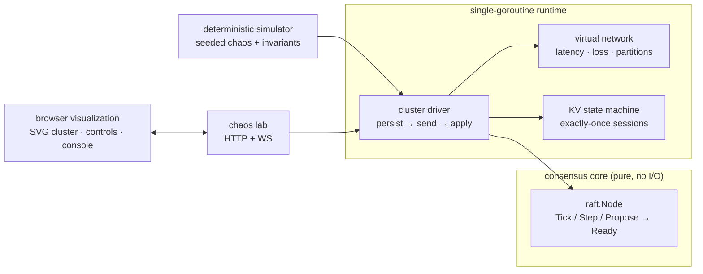

# QUORUM

**Raft consensus, implemented from scratch — with a browser chaos lab where you break the cluster and watch it heal.**

Quorum is a distributed key-value store built on the Raft consensus algorithm
([Ongaro & Ousterhout, 2014](https://raft.github.io/raft.pdf)), written in Go with zero
consensus dependencies. A five-node cluster runs over a virtual network with dials for
everything that goes wrong in real ones — latency, packet loss, partitions, crashed
hosts — and a live SVG visualization shows elections, log replication, and recovery as
they happen. Click a node to crash it. Partition the network mid-write. Watch the
minority-side leader accept a proposal it can never commit, then watch the truth win
when the network heals.

Underneath the theater is the serious part: the consensus core is a **pure state
machine** (no goroutines, timers, or I/O inside), so the exact same code that powers the
live lab runs under a **deterministic simulation harness** — seeded chaos schedules,
thousands of ticks, machine-checked safety invariants. A failing seed replays
identically, every time.

```
        ┌──────────────────────────────────────────────────────────┐
        │  QUORUM   raft consensus · chaos lab      LEADER n4 (t3) │
        ├──────────────────────────────────────────┬───────────────┤
        │                 ○ n1                     │ CHAOS         │
        │        ○ n5            ● n4 LEADER       │ isolate leader│
        │           ·(msg)· ·-·(msg)··             │ split 2|3     │
        │        ○ n3 ✕          ○ n2              │ loss ▁▂▃ 12%  │
        │       [██▒▒░]         [████░]            │ PUT color=teal│
        ├──────────────────────────────────────────┴───────────────┤
        │ n1 follower ✓ in sync   ·   t661 elected: node 4 (term 3)│
        └──────────────────────────────────────────────────────────┘
```

## Why this exists

Every distributed systems interview eventually arrives at the same questions: *how does
leader election avoid split brain? what happens to uncommitted entries on a partitioned
leader? how do you test any of this?* Quorum is those answers, running, with the
receipts checked by CI.

## Architecture



The `raft.Node` follows the etcd-raft school of design: the host calls `Tick()`
(logical time), `Step(msg)` (inbound messages), and `Propose(data)`, then drains a
`Ready` struct — messages to send, state to persist (*before* sending, per §5.1),
entries to apply. Because the host owns time and delivery order, "run 40 randomized
partition storms and prove nothing broke" is just a for-loop.

## The invariants CI actually checks

Every push runs 40 seeded chaos schedules (crashes, restarts, two-way partitions, up to
25% packet loss, latency spikes, concurrent client writes — ~1,600 ticks each) and then
asserts, across the entire history:

| Invariant | Raft § | Meaning |
| --- | --- | --- |
| Election safety | §5.2 | at most one leader per term, ever |
| Log matching | §5.3 | same index+term ⇒ identical logs up to that index |
| Leader completeness | §5.4 | committed entries survive every leadership change |
| State machine safety | §5.4.3 | no two nodes ever apply different commands at the same index |
| Convergence | — | after healing, exactly one leader and equal commit indexes |
| Determinism | — | identical seeds produce identical histories, or replay debugging is fiction |

Plus focused unit tests: FIFO/priority election rules, log conflict overwrite,
crash-restart with disk-state recovery, stale-leader step-down.

## Quick start

Prerequisites: Go 1.24+, Node 20+.

```bash
# 1. the cluster + lab API on :8090
cd server
go run ./cmd/quorum

# 2. the lab UI on :5174
cd lab
npm install
npm run dev
```

Open http://localhost:5174. Things to try, in escalating order of cruelty:

1. **PUT a key** and watch the AppendEntries fan out and the commit bars fill.
2. **Click the leader** to crash it — election within a couple of seconds, and your
   key survives (leader completeness, live).
3. **Isolate leader**: the old leader keeps believing until it hears the new term.
4. **Split 2|3 and write to both sides**: the minority side accepts proposals it can
   never commit; heal and watch its log get truncated and overwritten.
5. **Crank packet loss to 40%** and watch progress get slower but never wrong.
6. Restart a crashed node: it reboots from persisted term/vote/log and replays the
   committed prefix into its state machine.

## Project layout

```
server/
  cmd/quorum/          wiring: cluster + KV + lab server
  internal/raft/       the consensus core (pure; ~450 lines) + unit tests
  internal/vnet/       virtual network: seeded latency/loss/partitions
  internal/cluster/    single-goroutine runtime shared by lab and simulator
  internal/cluster/sim_test.go   the deterministic chaos harness
  internal/kv/         replicated state machine, exactly-once client sessions
  internal/lab/        HTTP/WS chaos API
lab/
  src/components/      SVG cluster view, chaos controls, replica matrix, console
```

## Honest limitations

Chosen simplifications, each with a known upgrade path: no log compaction/snapshots
(logs replay from index 1 on restart), no membership changes (fixed five nodes), writes
are acknowledged at *proposal* rather than commit (the UI says so explicitly), reads are
served from replicas without ReadIndex/lease semantics, and the "disk" in the lab is a
map — the persistence contract (persist before send) is enforced, the fsync is
simulated. The point is the consensus core and the testing methodology; those are real.

## License

MIT — see [LICENSE](LICENSE).
